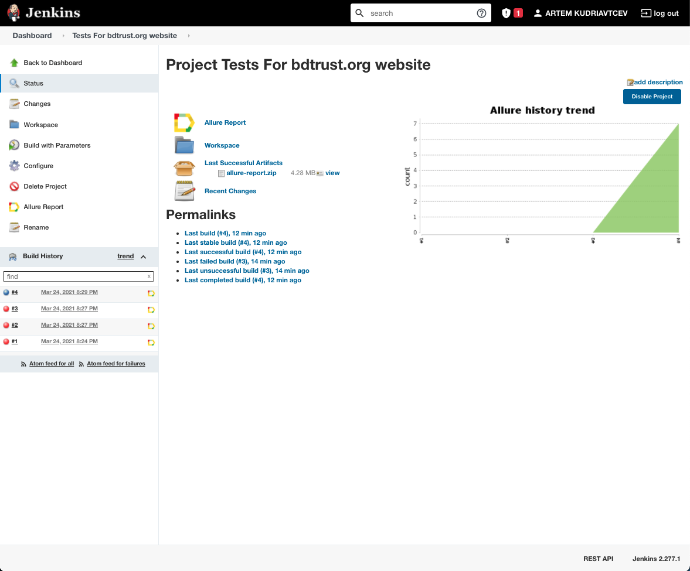
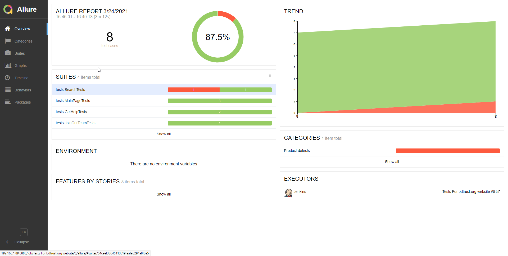
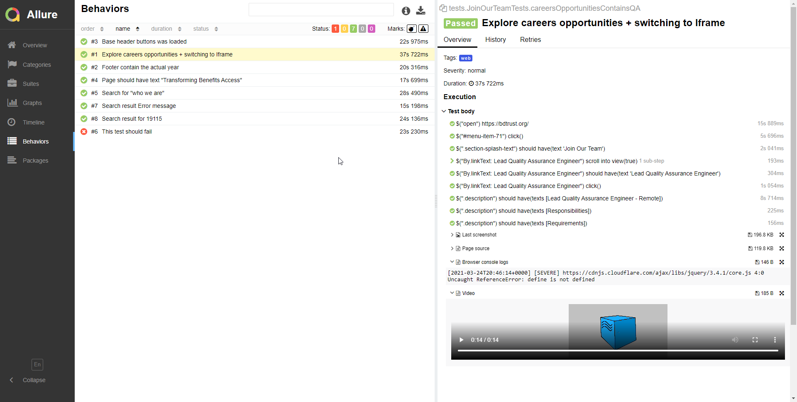
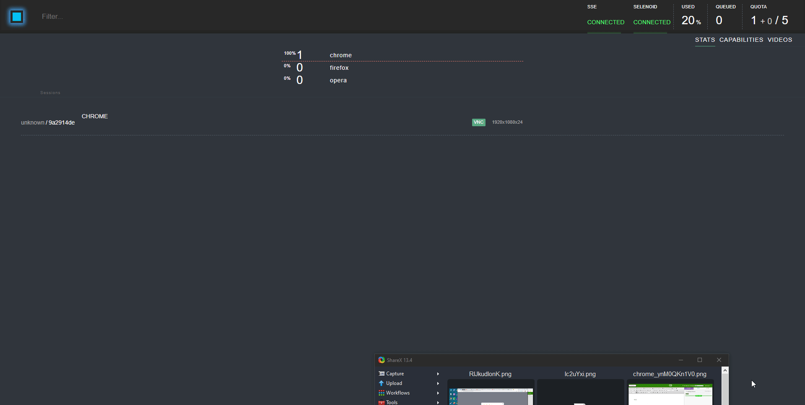

# Tests for bdtrust.org website
### UI tests:
- Main page tests
- Get help tests
- Join our team tests
- Search tests

## Technology Stack
**Java, Selenide, Junit5, Gradle, Allure Reports, Jenkins, Selenoid**
  

## Screenshots
#### *Jenkins - it is an open source automation server:*

 
 
 

#### *Allure Report - it is a flexible lightweight test report tool:*

 
 
 

#### *Selenoid - a lightning fast Selenium protocol implementation running browsers in Docker containers:*

